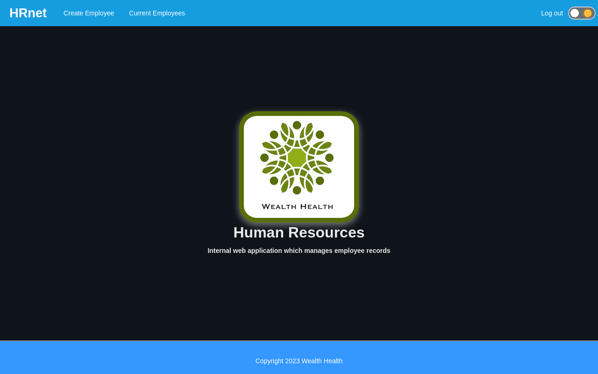
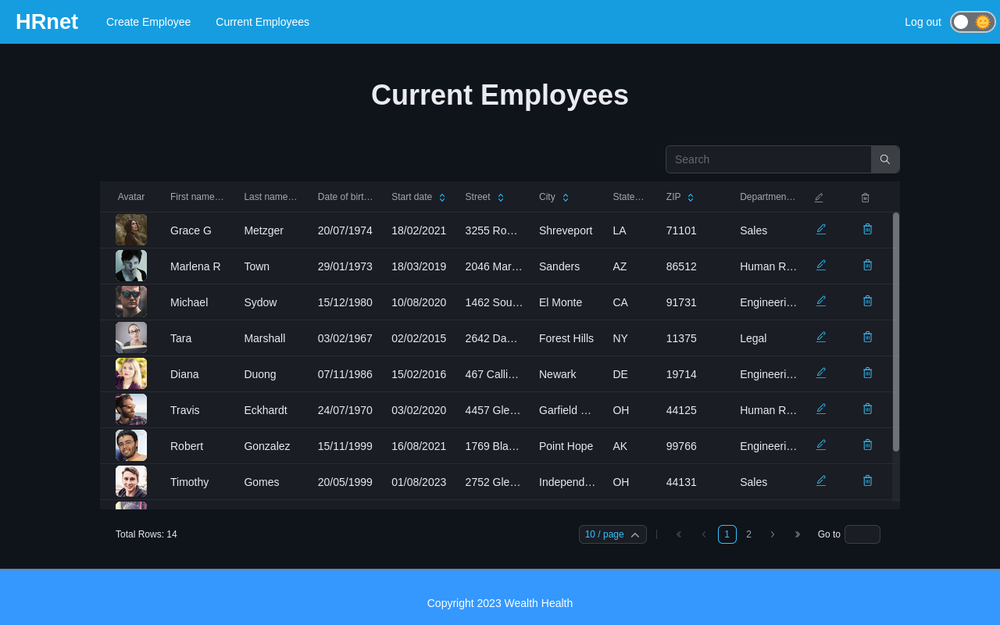

# Wealth Health HRnet : Internal web application which manages employee records

**Dependencies**

&nbsp;&nbsp;
&nbsp;&nbsp;
&nbsp;&nbsp;
&nbsp;&nbsp;
&nbsp;&nbsp;
&nbsp;&nbsp;

**devDependencies**

&nbsp;&nbsp;
&nbsp;&nbsp;

**Back Dependencies**

&nbsp;&nbsp;
&nbsp;&nbsp;
&nbsp;&nbsp;

Wealth Health HRnet is an internal web application which manages employee records

## Getting Started

### Launching the project

1. Fork the repository
2. Clone it on your computer
3. Install the dependencies with `npm install` or `yarn install`
4. Then run `npm start` or `yarn start` :
   - local dev server should start on port 4001 ([http://localhost:4001](http://localhost:4001)),
   - App should start on port 3000 ([http://localhost:3000](http://localhost:3000)).

